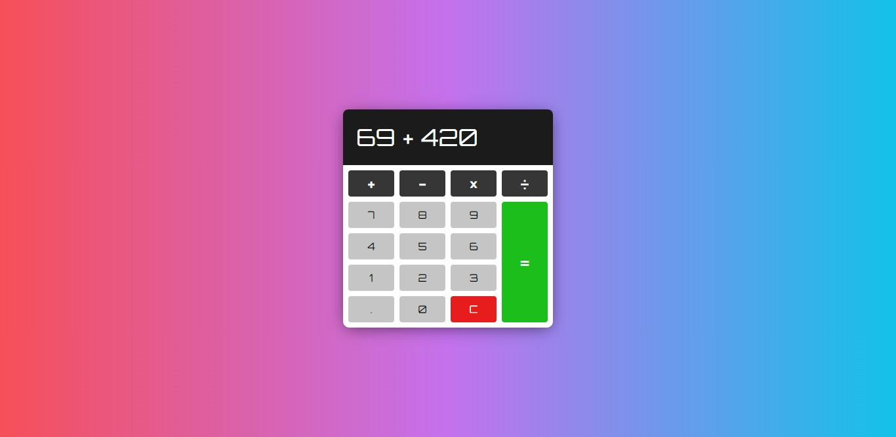

# About
A simple calculator with basic functionalities. Takes in values as a string, then converts them into an array, loops through it then calculates it in a BODMAS order. Icon by [Freepik](https://www.freepik.com). [Live site](https://clupai8o0.github.io/calculator)

# Preview
